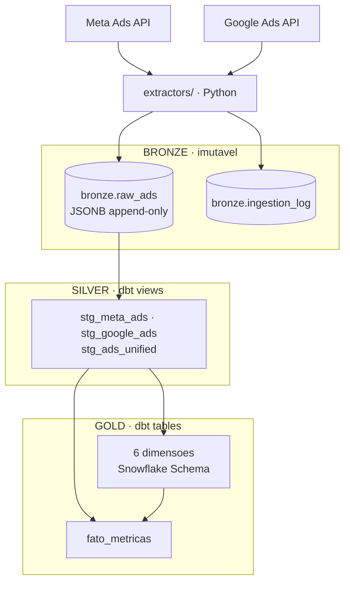

# Pipeline de Dados — Marketing Digital


Pipeline **ELT** containerizado que extrai metricas diarias de campanhas do **Meta Ads** e **Google Ads**, preserva o dado bruto em **PostgreSQL** e o transforma em um modelo dimensional unificado com **dbt**. Projetado como trabalho de conclusao de curso (TCC) em Engenharia de Dados.

---

## Arquitetura

Pipeline **ELT em camadas** (bronze → silver → gold). A extracao entrega o
payload da API sem transformar; toda transformacao acontece no banco,
materializada e testada pelo dbt.



O `main.py` orquestra extracao → carga bronze → `dbt build` (transformacao +
testes). Se qualquer etapa falhar, o pipeline interrompe com exit code 1.

Detalhes de projeto, validacao e limitacoes em
[`docs/arquitetura-elt.md`](docs/arquitetura-elt.md).

---

## Features

| Feature | Descricao |
|---|---|
| **Arquitetura em camadas** | Bronze (JSONB bruto, append-only) → Silver (limpeza e unificacao) → Gold (modelo dimensional) |
| **Idempotencia** | Reprocessar o mesmo periodo nao altera o resultado da gold; a bronze acumula snapshots e a silver mantem o mais recente |
| **Testes de dados** | 75 testes dbt: unicidade, nao-nulidade, dominios e integridade referencial entre fato e dimensoes |
| **Rastreabilidade** | Dado bruto preservado permite reprocessar todas as camadas sem chamar a API novamente |
| **Observabilidade** | `bronze.ingestion_log` registra lote, fonte, periodo e volume de cada carga |
| **Backfill historico** | Argumento `--start-date` / `--end-date` permite carga retroativa de qualquer periodo |
| **Snowflake Schema** | 5 dimensoes normalizadas em cadeia (Plataforma -> Conta -> Campanha -> AdSet -> Anuncio) + dim_tempo + 1 tabela fato com 9 metricas |
| **Multi-plataforma** | Meta Ads (Insights API com paginacao) e Google Ads (GAQL) unificados em schema comum |
| **Metricas avancadas** | spend, impressions, link_clicks, conversions, conversion_value, video_views, reach, profile_views, purchases |
| **DevSecOps** | Container non-root, mascaramento de logs (`mask()`), validacao fail-fast de env vars, zero SQL injection |

---

## Modelo de Dados

Schema `gold`, materializado pelo dbt. Dimensoes da hierarquia versionadas em
**SCD Tipo 2** — duas chaves por entidade:

```
<ent>_nk   chave natural     md5 da cadeia hierarquica, estavel entre renomeacoes
<ent>_sk   chave substituta  md5(nk + versao), uma por versao

dim_plataforma → dim_conta → dim_campanha → dim_adset → dim_anuncio
                                                              |
dim_tempo -------------------------------------------→ fato_metricas
                                                   grao: 1 anuncio x 1 dia

Metricas (9): spend | impressions | link_clicks | conversions
              conversion_value | video_views | reach
              profile_views | purchases
```

> Consultas ao fato precisam resolver a versao vigente pela data
> (`AND t.data BETWEEN d.valido_de AND d.valido_ate`). Sem isso o join vira
> 1:N e infla os agregados. Ver [`docs/der.md`](docs/der.md) e
> [`docs/queries_demo.sql`](docs/queries_demo.sql).

---

## Pre-requisitos

- [Docker](https://docs.docker.com/get-docker/) e [Docker Compose](https://docs.docker.com/compose/install/)
- Credenciais de API do **Meta Ads** (App ID, App Secret, Access Token, Business ID)
- Credenciais de API do **Google Ads** (Developer Token, Client ID/Secret, Refresh Token, Login Customer ID)

O Data Warehouse sobe junto com o projeto (PostgreSQL 16 em container), entao
nao e necessario nenhum banco externo. Para carregar num Postgres gerenciado
(ex: [Supabase](https://supabase.com/)), basta apontar `DW_DB_URL` para ele.

---

## Como Rodar

### 1. Clonar o repositorio

```bash
git clone https://github.com/<seu-usuario>/tcc_pipeline_dados.git
cd tcc_pipeline_dados
```

### 2. Configurar variaveis de ambiente

```bash
cp .env_template .env
# Preencha as credenciais das APIs no .env
```

### 3. Subir o Data Warehouse

```bash
docker compose up -d db
```

Nao ha DDL de inicializacao: o schema nasce do proprio pipeline — o
`bronze_loader` aplica o DDL da bronze e o dbt materializa silver e gold.
O banco fica exposto em `localhost:5433` (usuario `etl`, senha `etl`,
database `marketing_dw`).

### 4. Executar o pipeline

```bash
# Pipeline completo — extrai o dia anterior (D-1)
docker compose run --rm etl_app python main.py

# Backfill — carga historica de um periodo especifico
docker compose run --rm etl_app python main.py --start-date 2026-03-01 --end-date 2026-03-31

# Apenas uma plataforma (util quando as credenciais da outra estao indisponiveis)
docker compose run --rm etl_app python main.py --platforms meta

# Reprocessar os dados brutos ja extraidos, sem consumir a API
docker compose run --rm etl_app python main.py --skip-extract
```

### 4.1. Transformacoes e testes isolados

```bash
# Materializa silver e gold e roda os 75 testes de dados
docker compose run --rm -e DBT_PROFILES_DIR=/app/dbt -w /app/dbt etl_app dbt build

# Apenas os testes
docker compose run --rm -e DBT_PROFILES_DIR=/app/dbt -w /app/dbt etl_app dbt test

# Documentacao navegavel com grafo de lineage
docker compose run --rm -e DBT_PROFILES_DIR=/app/dbt -w /app/dbt etl_app dbt docs generate
```

### 5. Consultar o Data Warehouse

```bash
# Queries analiticas de demonstracao (inclui a prova de idempotencia)
docker exec -i tcc_dw psql -U etl -d marketing_dw < docs/queries_demo.sql

# Sessao interativa
docker exec -it tcc_dw psql -U etl -d marketing_dw
```

### 6. Execucao de modulos individuais (opcional)

```bash
# Apenas extracao
docker compose run --rm etl_app python extractors/meta_ads.py --start-date 2026-03-30 --end-date 2026-03-31

# Apenas a carga do bruto na bronze
docker compose run --rm etl_app python loaders/bronze_loader.py
```

---

## Estrutura do Projeto

```
tcc_pipeline_dados/
|-- config.py                  # Env vars, logging, mascaramento, conexao do dbt
|-- plataformas.py             # Registro unico das plataformas suportadas
|-- main.py                    # Orquestrador: extracao -> bronze -> dbt build
|-- Dockerfile                 # Python 3.11-slim, usuario non-root (UID 1000)
|-- docker-compose.yml         # Servicos db (PostgreSQL 16) e etl_app
|-- pyproject.toml             # Torna o projeto importavel (install editavel)
|-- requirements.txt           # Dependencias Python (inclui dbt-postgres)
|
|-- extractors/
|   |-- comum.py               # Casca comum: salvar bruto, laco de contas, CLI
|   |-- meta_ads.py            # Extrator Meta Ads (Insights API + paginacao)
|   |-- google_ads.py          # Extrator Google Ads (GAQL)
|
|-- loaders/
|   |-- bronze_loader.py       # Carga do JSON bruto na bronze
|
|-- sql/bronze/
|   |-- init_bronze.sql        # DDL da camada bronze + log de ingestao
|
|-- dbt/
|   |-- dbt_project.yml
|   |-- profiles.yml
|   |-- macros/                # generate_schema_name, sum_action_value, dimensao_scd2
|   |-- models/
|   |   |-- silver/            # stg_meta_ads, stg_google_ads, stg_ads_unified
|   |   |-- gold/              # 6 dimensoes + fato_metricas
|   |-- tests/                 # testes singulares (grao, SCD2, regressao entre lotes)
|
|-- scripts/
|   |-- generate_google_refresh_token.py
|   |-- oauth_manual.py        # Fluxo OAuth manual em dois passos
|
|-- docs/
    |-- arquitetura-elt.md     # Projeto das camadas e validacao de paridade
    |-- der.md                 # Diagrama entidade-relacionamento
    |-- queries_demo.sql       # Queries analiticas de demonstracao
    |-- notas-para-documentacao-tcc.md  # Insumo para a monografia
    |-- reuniao-orientador.md  # Material de orientacao academica
```

---

## Seguranca

Este projeto passou por uma auditoria de seguranca (DevSecOps) cobrindo:

- **Credenciais nos logs**: todos os IDs sensiveis mascarados via `config.mask()`; tracebacks sanitizados para nao expor tokens
- **SQL Injection**: 100% das queries usam bind parameters via SQLAlchemy; zero concatenacao de strings em SQL
- **Validacao de ambiente**: `config.validate_env()` verifica 11 variaveis obrigatorias no startup com fail-fast
- **Container hardening**: Dockerfile executa como usuario non-root (`etl`, UID 1000); `.dockerignore` impede que `.env` e `.git` entrem na imagem
- **Repositorio**: `.gitignore` exclui `.env` e arquivos temporarios

---

## Stack Tecnica

| Camada | Tecnologia |
|---|---|
| Linguagem | Python 3.11 |
| Container | Docker / Docker Compose |
| Extracao | facebook-business SDK, google-ads SDK |
| Carga do bruto | SQLAlchemy + psycopg2-binary |
| Transformacao | dbt-postgres (silver e gold no banco) |
| Banco | PostgreSQL 16 |
| Seguranca | python-dotenv, config.py (mask + validate_env) |

---

## Licenca

Este projeto e distribuido sob a licenca MIT. Consulte o arquivo `LICENSE` para mais detalhes.
