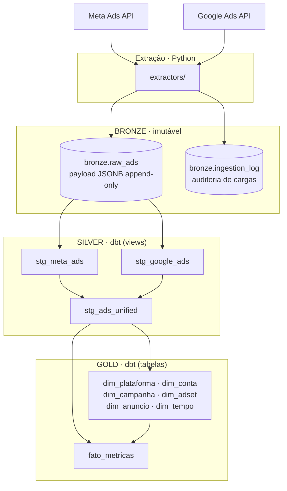

# Arquitetura ELT — bronze → silver → gold

Implementada em 05/08/2026, convivendo com o pipeline ETL original.

## Por que mudou

O ETL anterior gravava o dado bruto em arquivos temporários que **eram
sobrescritos a cada execução**. Consequência prática: descobrir um erro de
transformação exigia re-extrair da API. E API pode não estar disponível — o
acesso ao Google Ads ficou indisponível por meses neste projeto, o que quase
custou o dado de abril.

Na arquitetura em camadas o bruto é preservado, e todas as transformações
podem ser refeitas a partir dele sem tocar na fonte.

## O fluxo



## O que cada camada faz

### Bronze — `bronze.raw_ads`

Payload exatamente como a API devolveu, em `JSONB`, com metadados de
ingestão: `source`, `reference_date`, `extracted_at`, `batch_id`.

**É append-only.** Reprocessar o mesmo dia não sobrescreve: cria um lote novo.
Isso preserva o histórico das respostas da API e habilita uma análise que o
modelo anterior tornava impossível — medir a **deriva retroativa** das
métricas. A janela de atribuição do Meta revisa conversões por até 28 dias,
então o mesmo dia extraído em momentos diferentes traz números diferentes.
Com a bronze append-only, essa diferença fica registrada e é mensurável.

A tabela `bronze.ingestion_log` registra cada carga (lote, fonte, período,
volume, momento) — base de observabilidade que o pipeline não tinha.

### Silver — limpeza e unificação

Três views:

| Modelo | Responsabilidade |
|---|---|
| `stg_meta_ads` | Tipagem + desempacotamento de `actions`/`action_values` |
| `stg_google_ads` | Tipagem + alinhamento de nomenclatura ao vocabulário comum |
| `stg_ads_unified` | União das plataformas + surrogate keys encadeadas |

**Deduplicação:** como a bronze acumula snapshots, a silver aplica
`dense_rank()` por `(source, reference_date)` ordenado por `extracted_at
desc` e mantém apenas o mais recente. Último snapshot vence.

### Gold — modelo dimensional

O mesmo Snowflake Schema de antes, agora materializado por dbt: 6 dimensões
em hierarquia encadeada mais a tabela fato, com grão de um anúncio por dia.

**Dimensões versionadas em SCD Tipo 2.** Cada entidade tem duas chaves:

| Chave | Papel |
|---|---|
| `<ent>_nk` | Chave natural — `md5` da cadeia hierárquica, estável entre renomeações |
| `<ent>_sk` | Chave substituta — `md5(nk + versão)`, única por versão |

Os níveis se referenciam pela chave **natural** do pai, de modo que criar uma
nova versão de uma campanha não force novas versões em todos os seus anúncios.

A tabela fato aponta para a **versão vigente na data da métrica**, resolvida
por `join` na chave natural filtrado pelo intervalo de validade — o *surrogate
key pipeline* de Kimball. Os intervalos são contíguos por construção
(`valido_ate` = véspera do início da próxima versão; a última vai até
`9999-12-31`), então toda linha do fato encontra exatamente uma versão.

#### De onde vem o histórico

Da bronze. Como ela é append-only, o nome observado em cada extração fica
registrado. Isso é essencial porque **a API não permite reconstruir esse
histórico**: consultada hoje, ela devolve o nome atual mesmo para datas
passadas.

A consequência metodológica precisa estar no texto: o versionamento reflete
**o que foi observado no momento da extração**, não o estado real da
plataforma naquele dia. É uma aproximação — a única possível sem *change data
capture* na origem — e ela subestima renomeações ocorridas entre duas
extrações.

#### Demonstração

Três campanhas foram renomeadas entre abril e agosto nos dados reais:

| `external_id` | v1 (07/04 – 31/07) | v2 (01/08 – atual) |
|---|---|---|
| `EXTERNAL_ID_A` | `[MARCA_A] [OBJETIVO] [CANAL] DD/MM/AAAA` | `[MARCA_A] [OBJETIVO] [CANAL] AAMMDD` |
| `EXTERNAL_ID_B` | `[FORMATO] [SECAO] DD/MM/AA` | `[OBJETIVO] [SECAO] [FORMATO] - DD/MM/AA` |
| `EXTERNAL_ID_C` | `[MARCA_C] EMPRESA_C_GRAFIA_1 DD-MM` | `[MARCA_C] EMPRESA_C_GRAFIA_2 DD-MM` |

Consultando o investimento por dia, cada data exibe o nome vigente à época —
o relatório de abril não é mais reescrito pela renomeação de agosto.

`dim_campanha` passou a ter 180 linhas para 177 entidades; `dim_adset`, 337
para 334; `dim_conta`, 58 para 57. A diferença são exatamente as versões.

Dois testes garantem a consistência do versionamento:
`assert_scd2_sem_sobreposicao` (intervalos não se sobrepõem, o que duplicaria
métricas no join) e `assert_scd2_uma_versao_atual` (exatamente uma versão
corrente por entidade).

## O que se ganhou e o que se perdeu

| | ETL anterior | ELT atual |
|---|---|---|
| Reprocessar sem API | ❌ | ✅ |
| Histórico do dado bruto | ❌ | ✅ append-only |
| Testes de dados | ❌ | ✅ 73 testes |
| Histórico de renomeações | ❌ SCD Tipo 1 | ✅ SCD Tipo 2 |
| Lineage documentado | ❌ | ✅ gerado pelo dbt |
| Auditoria de execuções | ❌ | ✅ `ingestion_log` |
| Integridade referencial | FKs do banco | testes `relationships` |

> A perda das foreign keys é o custo real da migração. No ETL a integridade
> era imposta pelo PostgreSQL, que rejeitava a escrita inválida. No dbt ela é
> **verificada após a materialização** pelos testes `relationships`. É uma
> garantia mais fraca em natureza — detecta em vez de impedir — mas cobre os
> mesmos relacionamentos e roda a cada execução do `dbt build`.

## Validação: paridade com o ETL

O ELT foi validado contra o ETL sobre os mesmos 1.672 registros. Resultado:

| Métrica | Confere? |
|---|---|
| Linhas por dia e plataforma | ✅ idêntico |
| `spend` | ✅ idêntico |
| `impressions`, `link_clicks` | ✅ idêntico |
| `conversion_value`, `reach`, `video_views` | ✅ idêntico |
| `conversions` | ⚠️ divergência intencional |

**A divergência em `conversions` é uma correção, não um erro.** O Google Ads
reporta conversões **fracionadas** — uma conversão pode ser creditada
parcialmente a vários anúncios pela modelagem de atribuição. O ETL convertia
cada linha com `int()`, que trunca. Somando as 1.672 linhas:

- ETL: **376** conversões (truncado linha a linha)
- ELT: **380,29** conversões (valor real da API)

O modelo antigo descartava silenciosamente ~1% das conversões do Google. A
coluna passou a ser `NUMERIC` na gold.

> [!note] Achado metodológico
> Esse erro só apareceu porque a migração foi validada por paridade em vez de
> ser aceita por "os testes passaram". Os 65 testes do dbt passavam com o
> pipeline produzindo números errados — um bug de ordem de colunas no
> `union all`, que casa colunas por posição e não por nome, trocava
> `reach`, `conversions` e `conversion_value` do Google entre si.
> Testes de schema não pegam erro de conteúdo.

## Como rodar

```bash
# Pipeline completo em modo ELT (default)
docker compose run --rm etl_app python main.py

# Reprocessar sem consumir a API
docker compose run --rm etl_app python main.py --skip-extract

# Caminho ETL original, para comparação
docker compose run --rm etl_app python main.py --mode etl

# Só as transformações e testes
docker compose run --rm -e DBT_PROFILES_DIR=/app/dbt -w /app/dbt etl_app dbt build

# Documentação navegável com o grafo de lineage
docker compose run --rm -e DBT_PROFILES_DIR=/app/dbt -w /app/dbt etl_app dbt docs generate
```

## Limitações que permanecem

- **SCD Tipo 2 limitado pela granularidade da extração** — só detecta
  renomeações entre extrações, não no instante em que ocorrem.
- **Materialização full-refresh** — a gold é reconstruída inteira a cada
  execução. Adequado ao volume atual (~1,7 mil linhas); exigiria modelos
  incrementais em outra ordem de grandeza.
- **Cobertura desigual de métricas** — `reach`, `video_views`,
  `profile_views` e `purchases` continuam zerados para o Google, por
  limitação da consulta GAQL nesse nível.
