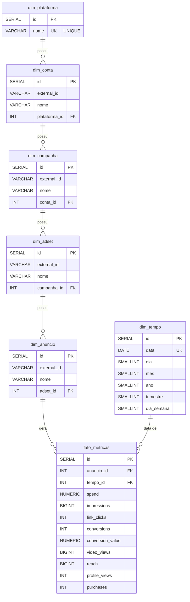

# Diagrama Entidade-Relacionamento (DER)

Modelo dimensional do pipeline de dados de marketing. Implementa um **Snowflake Schema**: 5 dimensoes normalizadas em cadeia (Plataforma -> Conta -> Campanha -> AdSet -> Anuncio) + `dim_tempo` + 1 tabela fato, conforme DDL em [`init_db.sql`](../init_db.sql).

> **Por que Snowflake e nao Star?** A hierarquia de ads e mantida em tabelas separadas com FKs encadeadas, espelhando a estrutura nativa das APIs Meta Ads e Google Ads. Isso preserva integridade referencial, evita anomalias de update em nomes que mudam com frequencia (renomeacao de campanhas) e simplifica o UPSERT idempotente por nivel.

## Diagrama



## Leitura do modelo

### Hierarquia de dimensoes (Meta Ads / Google Ads)

```
Plataforma -> Conta -> Campanha -> AdSet -> Anuncio
```

Cada nivel possui chave unica composta `(external_id, parent_id)`. Isso permite que IDs externos iguais coexistam entre plataformas distintas (ex: uma Campaign do Meta e uma Campaign do Google com o mesmo ID externo nao colidem).

### Tabela fato

- **Grao:** 1 anuncio x 1 dia, garantido por `UNIQUE(anuncio_id, tempo_id)`.
- **Idempotencia:** o constraint acima e a base do `INSERT ... ON CONFLICT DO UPDATE` em `loaders/supabase_loader.py` — reprocessar o mesmo dia nao duplica linhas.
- **Metricas (9):** `spend`, `impressions`, `link_clicks`, `conversions`, `conversion_value`, `video_views`, `reach`, `profile_views`, `purchases`.

### Dimensao `dim_tempo`

Desconectada da hierarquia de ads. Mantem atributos pre-calculados (`dia`, `mes`, `ano`, `trimestre`, `dia_semana`) para acelerar agregacoes analiticas sem recomputar a partir da coluna `data`.

## Cardinalidades

| Relacionamento | Tipo |
|---|---|
| `dim_plataforma` -> `dim_conta` | 1:N |
| `dim_conta` -> `dim_campanha` | 1:N |
| `dim_campanha` -> `dim_adset` | 1:N |
| `dim_adset` -> `dim_anuncio` | 1:N |
| `dim_anuncio` -> `fato_metricas` | 1:N |
| `dim_tempo` -> `fato_metricas` | 1:N |

Todas as FKs sao `ON DELETE RESTRICT` — exclusao de dimensoes referenciadas e bloqueada, preservando a integridade historica do fato.
