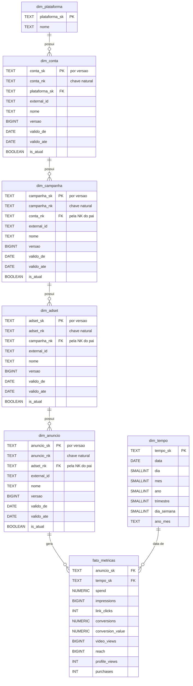

# Diagrama Entidade-Relacionamento (DER)

Modelo dimensional da camada **gold**, materializado pelo dbt a partir da silver
(ver [`arquitetura-elt`](arquitetura-elt.md)). Implementa um **Snowflake
Schema**: 5 dimensoes normalizadas em cadeia (Plataforma -> Conta -> Campanha ->
AdSet -> Anuncio) + `dim_tempo` + 1 tabela fato. Os modelos estao em
`dbt/models/gold/`.

> **Por que Snowflake e nao Star?** A hierarquia de ads e mantida em tabelas
> separadas, espelhando a estrutura nativa das APIs Meta Ads e Google Ads. Isso
> evita anomalias em nomes que mudam com frequencia (renomeacao de campanhas) e
> permite versionar cada nivel de forma independente.

## Diagrama



## Leitura do modelo

### Hierarquia de dimensoes (Meta Ads / Google Ads)

```
Plataforma -> Conta -> Campanha -> AdSet -> Anuncio
```

### As duas chaves de cada dimensao

| Chave | Definicao | Papel |
|---|---|---|
| `<ent>_nk` | `md5` da cadeia hierarquica completa | Chave **natural**: identifica a entidade, estavel entre renomeacoes |
| `<ent>_sk` | `md5(nk + versao)` | Chave **substituta**: uma por versao da entidade |

A cadeia entra na chave (`plataforma \| conta \| campanha \| ...`), o que faz
IDs externos iguais em plataformas diferentes nao colidirem — uma campanha do
Meta e uma do Google com o mesmo ID externo produzem chaves distintas.

Os niveis se referenciam pela chave **natural** do pai. Assim, criar uma nova
versao de uma campanha nao forca novas versoes em todos os seus anuncios.

### Dimensoes versionadas (SCD Tipo 2)

Todas as dimensoes da hierarquia, exceto `dim_plataforma`, sao versionadas pela
macro `dimensao_scd2`. Uma renomeacao fecha a versao vigente (`valido_ate` =
vespera) e abre outra. Os intervalos sao contiguos por construcao e a ultima
versao vai ate `9999-12-31`.

> ⚠️ **O versionamento muda o contrato de consulta.** Juntar o fato a uma
> dimensao pela chave natural **sem** restringir ao intervalo de validade
> transforma o join em 1:N e infla os agregados sem produzir erro nenhum. A
> forma correta esta em `docs/queries_demo.sql`:
>
> ```sql
> JOIN gold.dim_campanha c
>   ON  c.campanha_nk = s.campanha_nk
>   AND t.data BETWEEN c.valido_de AND c.valido_ate
> ```

### Tabela fato

- **Grao:** 1 anuncio x 1 dia.
- **Idempotencia:** garantida antes do fato, na silver — a bronze acumula um
  snapshot por extracao e a silver mantem apenas o mais recente de cada dia.
  Reprocessar o mesmo periodo nao duplica linhas. Verificado pelo teste
  `assert_grao_unico_fato`.
- **Metricas (9):** `spend`, `impressions`, `link_clicks`, `conversions`,
  `conversion_value`, `video_views`, `reach`, `profile_views`, `purchases`.
- `conversions` e `conversion_value` sao **numericos, nao inteiros**: o Google
  reporta conversoes fracionadas por efeito da modelagem de atribuicao.

### Dimensao `dim_tempo`

Desconectada da hierarquia de ads. Mantem atributos pre-calculados (`dia`,
`mes`, `ano`, `trimestre`, `dia_semana`, `ano_mes`) para acelerar agregacoes
analiticas sem recomputar a partir da coluna `data`.

## Cardinalidades

| Relacionamento | Tipo | Ligado por |
|---|---|---|
| `dim_plataforma` -> `dim_conta` | 1:N | `plataforma_sk` |
| `dim_conta` -> `dim_campanha` | 1:N | `conta_nk` + validade |
| `dim_campanha` -> `dim_adset` | 1:N | `campanha_nk` + validade |
| `dim_adset` -> `dim_anuncio` | 1:N | `adset_nk` + validade |
| `dim_anuncio` -> `fato_metricas` | 1:N | `anuncio_sk` |
| `dim_tempo` -> `fato_metricas` | 1:N | `tempo_sk` |

## Camada de consumo

`gold.vw_metricas_completas` (view) percorre essa hierarquia uma vez, com a
clausula de validade em cada nivel versionado, e expoe o fato com todos os
nomes ja resolvidos na versao vigente na data. Mesmo grao do fato: 1 anuncio x
1 dia.

Ela existe porque a tabela de cardinalidades acima e uma armadilha para quem
consulta: as ligacoes marcadas com "+ validade" produzem 1:N se a clausula for
esquecida, e o resultado continua parecendo correto — so maior. Medido em
06/08/2026: 7,8% de inflacao no investimento total.

**Consulte a view, nao as dimensoes.** O acesso direto as dimensoes so se
justifica para inspecionar o versionamento em si (ver query 7 de
[`queries_demo.sql`](queries_demo.sql)).

## Integridade referencial

**Nao ha foreign keys no banco.** As tabelas da gold sao materializadas pelo
dbt, que recria cada uma a cada execucao — FKs impediriam a materializacao.

A integridade e verificada por testes `relationships` do dbt, executados a cada
`dbt build`. E uma garantia mais fraca em natureza (detecta apos a
materializacao, em vez de impedir na escrita), mas cobre os mesmos
relacionamentos. O custo esta declarado como limitacao em
[`arquitetura-elt`](arquitetura-elt.md).
