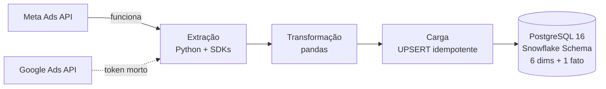

# Reunião de orientação — 05/08/2026

> [!abstract] Em uma frase
> O pipeline **funciona ponta a ponta e extrai dados ao vivo**; a discussão da
> reunião é sobre **escopo acadêmico** (o que transforma isso em TCC) e sobre
> **manter ou não o PostgreSQL** como Data Warehouse.

> [!tip]- Como usar esta nota durante a reunião
> As perguntas estão em checkbox — marque conforme forem respondidas.
> Cada bloco tem um callout `[!check]` com a resposta que eu recomendo defender,
> caso o professor devolva a pergunta para você.
> No fim há uma seção vazia para anotar as decisões.

---

## Estado atual

| Etapa | Situação |
|---|---|
| Extração Meta Ads | ✅ ao vivo — 87 contas em ~2 min |
| Extração Google Ads | ✅ ao vivo — 64 subcontas via MCC |
| Camada bronze | ✅ JSONB append-only + log de ingestão |
| Camada silver | ✅ 3 views dbt, dedup por recência |
| Camada gold | ✅ Snowflake Schema materializado por dbt |
| Testes de dados | ✅ 72 testes dbt passando |
| Historização | ✅ SCD Tipo 2 nas dimensões (05/08) |
| Data Warehouse | ✅ PostgreSQL 16 em container |
| Orquestração | ✅ Airflow 3.3.0 — DAG diária, uma task por etapa (07/08) |

> [!success] Arquitetura ELT implementada em 05/08
> Migrado de ETL (pandas + CSVs temporários) para **bronze → silver → gold**
> com dbt. O caminho antigo foi mantido em `--mode etl` até a paridade ser
> validada e **removido em 06/08**: o projeto tem uma arquitetura só. O código
> continua no histórico do git. Projeto detalhado em [[arquitetura-elt]].

### Dados carregados

| Data | Plataforma | Anúncios | Investimento |
|---|---|---|---|
| 07/04 | Google Ads | 170 | R$ 2.215,39 |
| 07/04 | Meta Ads | 139 | R$ 1.741,20 |
| 03/08 | Meta Ads | 125 | R$ 1.450,20 |
| 04/08 | Meta Ads | 147 | R$ 1.822,67 |

==581 linhas na tabela fato, 0 duplicatas== no grão `(anúncio, dia)` após
múltiplas execuções sobre os mesmos períodos. Os dias 03 e 04/08 foram
extraídos ao vivo hoje.

> [!success] Google Ads foi restabelecido em 05/08
> A extração estava quebrada desde a saída da empresa: o refresh token tinha
> sido gerado pela conta corporativa, apagada junto com o desligamento
> (`invalid_grant: Account has been deleted`).
> Resolvido com **acesso somente-leitura ao MCC** concedido a um e-mail pessoal
> + novo refresh token. Nenhuma linha de código precisou mudar — o acesso foi
> pedido no nível certo (conta de gerenciamento, não contas individuais).

> [!warning] Pendência técnica com prazo
> O projeto OAuth está com a tela de consentimento em modo **Testing**, e nesse
> modo o refresh token do Google ==expira em 7 dias==. Precisa ser publicado em
> produção no Google Cloud Console, senão o pipeline quebra sozinho —
> provavelmente na semana da defesa.

---

## Roteiro da demonstração

- [ ] **1.** Subir o warehouse — `docker compose up -d db`
- [ ] **2.** Rodar o pipeline — `docker compose run --rm etl_app python main.py --skip-extract`
- [ ] **3.** Rodar **de novo** e mostrar que a fato não cresce ⭐
- [ ] **4.** Queries analíticas — `docker exec -i tcc_dw psql -U etl -d marketing_dw < docs/queries_demo.sql`
- [ ] **5.** Extração ao vivo — `main.py --platforms meta --start-date 2026-08-02 --end-date 2026-08-02`

> [!success] O passo 3 é o ponto alto
> Rodar o mesmo período duas vezes e a tabela fato continuar do mesmo tamanho
> prova a **idempotência**. É o argumento de engenharia mais forte do projeto:
> reprocessamento seguro é o que permite backfill e correção de dados sem
> duplicar nada. A query 5 do `queries_demo.sql` formaliza isso — retorna 0 linhas.

> [!warning] Cuidado no passo 5
> Os dias 03 e 04/08 **já estão carregados**. Para mostrar a extração
> acontecendo, use uma data diferente. A varredura das 87 contas leva ~2 min —
> não deixe para rodar isso com o professor esperando em silêncio.

---

## A decisão do banco: PostgreSQL ou colunar?

> [!question] A pergunta que ele vai fazer
> "Por que PostgreSQL, que é um banco transacional row-store, e não um banco
> colunar, que é o padrão para Data Warehouse?"

### Os números medidos

| Métrica | Valor |
|---|---|
| Meta Ads (87 contas) | 125–147 linhas/dia |
| Google Ads | 170 linhas/dia |
| Total realista | ~300 linhas/dia |
| Projeção anual | ~110 mil linhas/ano |
| 5 anos de backfill | < 600 mil linhas |
| Tamanho atual do banco | 8,4 MB |

> [!check] Resposta recomendada: **manter o PostgreSQL**
> Nesse volume o data mart inteiro cabe na memória. PostgreSQL com índice em
> `(anuncio_id, tempo_id)` responde as agregações em milissegundos. Bancos
> colunares passam a fazer diferença decisiva em **dezenas a centenas de milhões
> de linhas**. Migrar agora seria decisão orientada por tecnologia, não por
> requisito — ==exatamente o tipo de escolha que uma banca ataca==.

### Como transformar a pergunta em contribuição

Não defenda com opinião — defenda com medição. Proposta: incluir um
**benchmark comparativo** no TCC.

| Item | Definição |
|---|---|
| Contendores | PostgreSQL (row-store) × DuckDB (column-store) |
| Constante | Mesmo schema, mesmos dados, mesmas 5 consultas |
| Variável | Volume: 10 mil / 1 milhão / 50 milhões de linhas sintéticas |
| Saída | Tabela de latências + gráfico → seção de resultados |

> [!info] O custo é baixo
> DuckDB é um `pip install`, lê os mesmos CSVs e aceita SQL quase idêntico.
> E você já tem DuckDB rodando no `b3-data-pipeline` — dá para reaproveitar
> o que já sabe.

### Argumentos de reserva

> [!note]- Quatro linhas de defesa, se ele insistir
> 1. **Adequação ao volume** — a escolha segue o requisito, não a moda.
> 2. **Escritas frequentes e UPSERT** — a carga é reprocessamento diário com
>    `INSERT ... ON CONFLICT`. Row-stores lidam bem; colunares têm atualização
>    pontual mais custosa (ClickHouse usa mutações assíncronas).
> 3. **Integridade referencial** — o Snowflake Schema depende de FKs entre os 5
>    níveis da hierarquia. A maioria dos colunares não impõe FK.
> 4. **Caminho de evolução documentado** — se o volume crescer, dá para adotar
>    extensões colunares no próprio PostgreSQL (Citus columnar, TimescaleDB) ou
>    espelhar os marts em DuckDB, sem trocar de banco.

> [!warning] Risco do Supabase no dia da defesa
> O plano gratuito pausa projetos inativos. O Postgres local em container já
> elimina essa dependência — **confirmar se a banca exige o sistema em nuvem**.

---

## Perguntas para o orientador

### Bloco A — Escopo e contribuição

- [ ] **A1.** O que diferencia este trabalho de um projeto técnico de portfólio? Um pipeline funcionando basta, ou a banca espera contribuição avaliável?
- [ ] **A2.** A comparação PostgreSQL × colunar seria aceita como contribuição experimental, ou o esforço deve ir para outra frente?
- [ ] **A3.** Qual metodologia devo declarar — estudo de caso, Design Science Research, pesquisa aplicada?
- [ ] **A4.** Qual referencial teórico para modelagem dimensional — Kimball, Inmon, ou os dois em contraste?

> [!check] Onde eu quero chegar
> Que ele valide o benchmark como contribuição (A2). Isso resolve a pergunta do
> banco e dá uma seção de resultados ao texto. A3 importa mais do que parece:
> a metodologia define **que evidências você precisa registrar durante o
> semestre** — se for DSR, cada iteração precisa ficar documentada.

### Bloco B — Arquitetura

- [ ] **B1.** O modelo está como Snowflake (Plataforma → Conta → Campanha → AdSet → Anúncio). Vê problema em defender isso em vez de achatar num Star Schema?
- [ ] **B2.** **SCD Tipo 2** é esperado para nível de TCC? Está implementado desde 05/08 — renomear uma campanha cria uma versão nova em vez de sobrescrever o histórico. O DW tem 3 versões, todas nascidas da fronteira abril↔agosto.
- [ ] **B3.** O ELT em camadas **já está implementado** com dbt. A troca custou as foreign keys do banco, que viraram testes `relationships`. O senhor considera essa perda aceitável, dado o ganho em testabilidade e rastreabilidade?
- [ ] **B4.** **Airflow é requisito ou meio?** Implementado em 07/08 (3.3.0, uma task por etapa, janela móvel de 7 dias, DAG nasce pausada). A ferramenta será avaliada, ou o que importa é demonstrar orquestração?

> [!check] Onde eu quero chegar
> **B2 é a pergunta que ele provavelmente faria primeiro** — chegar nela antes
> mostra que você conhece a literatura. Sobre B4: a documentação já entregue
> promete Airflow, e você já subiu Airflow no `b3-data-pipeline`, então manter é
> barato e rende.
> B3 mudou de natureza: não é mais "vale reestruturar?", é "a arquitetura nova
> se sustenta?". ==Leve o achado do bug de paridade== (abaixo) — é a melhor
> evidência de rigor metodológico que você tem para mostrar.

### Bloco C — Dados, ética e reprodutibilidade

- [ ] **C1.** ⚠️ Os dados são **reais, de clientes de uma agência** — nomes de empresas, campanhas e valores investidos. Anonimizar? Autorização formal? Dados sintéticos na versão publicada?
- [ ] **C2.** Tokens de API expiram — o do Google **já expirou**. É aceitável demonstrar com **dataset congelado** e deixar a extração ao vivo como complemento?
- [ ] **C3.** Que volume de dados ele espera ver? Faz sentido gerar **volume sintético** para sustentar afirmações sobre desempenho?

> [!danger] C1 é a pergunta mais importante da lista
> Impacta a escrita, o repositório público e a LGPD. Um TCC com dados
> identificáveis de clientes, publicado em repositório institucional, é problema
> jurídico real — não é preciosismo acadêmico. Faça essa pergunta **cedo**, não
> no fim da reunião.

### Bloco D — Qualidade e avaliação

- [ ] **D1.** Que evidência de qualidade é esperada — pytest, testes de dados (Great Expectations, dbt tests), ou a demonstração de idempotência basta?
- [ ] **D2.** A banca espera **camada de consumo** (dashboard), ou o pipeline até o DW encerra o escopo?
- [ ] **D3.** Quais os **critérios de avaliação** da defesa e os marcos do semestre? O que precisa estar pronto na próxima reunião?
- [ ] **D4.** Quanto a arquitetura pode divergir da **documentação já entregue** sem invalidá-la? (o texto cita Python, PostgreSQL e Airflow)

> [!check] Não saia da reunião sem D3
> É a única pergunta que define o seu cronograma. Se sobrar pouco tempo,
> pule qualquer outra menos essa e a C1.

---

## Um achado que vale contar

Durante a migração para ELT, os 65 testes do dbt passavam — e o pipeline
produzia **números errados**.

O `union all` do SQL casa colunas por **posição, não por nome**. Os dois
modelos silver emitiam `reach`, `conversions` e `conversion_value` em ordens
diferentes, então as métricas do Google entravam trocadas entre si. Nenhum
teste de schema pega isso: os tipos batem, as chaves são únicas, nada é nulo.

O erro só apareceu porque a migração foi validada por **paridade contra o
pipeline antigo**, métrica a métrica.

> [!quote] A lição metodológica
> Teste de schema verifica estrutura; não verifica conteúdo. Reescrever um
> pipeline exige comparar os números com a implementação anterior — "os testes
> passaram" não é evidência de correção.

E a validação ainda revelou um **erro no pipeline original**: o ETL convertia
conversões com `int()`, truncando linha a linha. Como o Google Ads reporta
conversões fracionadas por efeito da modelagem de atribuição, o modelo antigo
descartava silenciosamente ~1% das conversões (376 contra 380,29 reais).

---

## Limitações conhecidas

> [!note] Levante você mesmo — antes que a banca levante
> Reconhecer limitação é consciência crítica; ser pego por ela é falha.

- **Cobertura desigual de métricas** — a query GAQL do Google não retorna `reach` nem `purchases` nesse nível; as colunas ficam zeradas para a plataforma e distorcem comparação direta. `video_views` passou a ser extraído em 06/08, mas com definição diferente da do Meta (TrueView de 30s contra 3s), o que impede somar as duas plataformas nessa métrica.
- **Materialização full-refresh** — a gold é reconstruída inteira a cada execução. Adequado a 1,7 mil linhas, insuficiente em outra ordem de grandeza.
- **Integridade referencial mais fraca** — as FKs do banco viraram testes `relationships`, que detectam violação após a materialização em vez de impedi-la na escrita.

### Resolvidas em 05/08

- ~~Sem testes automatizados~~ → 72 testes dbt
- ~~Sem camada raw preservada~~ → bronze append-only
- ~~Sem observabilidade~~ → `bronze.ingestion_log`
- ~~Reprocessar exige chamar a API~~ → todas as camadas reconstroem a partir da bronze
- ~~Sem SCD Tipo 2~~ → dimensões versionadas pela macro `dimensao_scd2`; o fato resolve a versão vigente por `data between valido_de and valido_ate`. O histórico vem da bronze, não da API — consultada hoje ela devolve o nome atual para datas passadas.

### Resolvida em 07/08

- ~~Sem orquestração~~ → **Airflow 3.3.0**, DAG `pipeline_marketing_diario`: uma task por etapa (retry seletivo em vez de reexecutar 2 min de extração), janela móvel de 7 dias porque as métricas do Meta mudam retroativamente por até 28 dias, `catchup=False` para não achatar o SCD2, e a DAG nasce pausada porque consome API de produção com dado real.

---

## Anotações da reunião

### Decisões

-

### Pendências para mim

- [ ]

### Próxima reunião

**Data:**
**Preciso levar:**

---

## Referências no repositório

| Arquivo | Conteúdo |
|---|---|
| `README.md` | visão geral e comandos |
| `docs/der.md` | diagrama entidade-relacionamento |
| `docs/queries_demo.sql` | queries analíticas + prova de idempotência |
| `sql/bronze/init_bronze.sql` | DDL da camada bronze (silver e gold nascem do dbt) |
